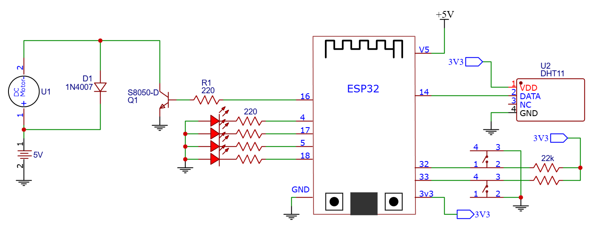

# ESP32 Fan Controller with Flutter App 

An ESP32-based fan controller system for a DC motor (manual and automatic speed control) with a custom Android app built using Flutter

## Features
- DC motor speed control using PWM 
  - **PWM Mode**: Manual control of fan speed with 4 levels: OFF, Level 1, Level 2, Level 3
  - **Automation Mode**: Fan speed is automatically adjusted based on temperature data from the sensor
- Automatic control based on temperature thresholds
- Bluetooth Classic (BR/EDR) communication
- Temperature & humidity monitoring
- Custom Flutter Android app:
  - Bluetooth connection status
  - Control fan speed, mode
  - Real-time temperature and humidity from sensor
 
## Hardware Schematic
### Schematic Diagram

ESP32  
 ├─ PWM → BJT → DC Motor  
 ├─ GPIO → Buttons  
 ├─ GPIO → LEDs  
 ├─ GPIO → DHT11  
 └─ Bluetooth → Flutter App  
 

### Hardware Components
- Mandatory:
  - Microcontroller: ESP-WROOM-32 
  - Sensor: DHT-11 Sensor
  - Motor: R140 DC motor
  - BJT: S8050-D 25V 1.5A with 220Ω Resistor 
  - 1N4007 Diode
  - 2 4-leg tactile switches, 2 22kΩ pull-up resistors 
  - 5VDC seperated source DC motor 
  - Some wires
- Optional:
  - LEDs and 220Ω resistors for LEDs

### Pins 
| Pin | Connect | Usage | Pin | Connect | Usage |
|----------|-----------|--------|----------|-----------|--------|
| 16 | DC Motor | PWM control | 04 | LED | Bluetooth connectivity indicator |
| 14 | DHT-11 Sensor | Received signal | 17 | LED | Sensor reading status |
| 32 | Button | Mode switch | 05 | LED | Send data to phone indicator |
| 33 | Button | PWM Level switch | 18 | LED | Mode indicator |

### Design Notes
- ESP32 is powered by 5V through the onboard voltage regulator
- The DC motor is powered by a separate 5V DC supply to reduce noise and voltage drops
- An NPN BJT is used as a low-side switch for PWM motor control; a logic-level MOSFET is recommended for higher efficiency and lower power dissipation
- ESP32 and motor power supplies share a common ground reference
- Flyback diode is placed across the DC motor to protect the switching device from inductive voltage spikes
  
## Code Structure
The code is built using FreeRTOS structured into multiple tasks for concurrent operation. Since the module has dual-core, tasks are distributed across both cores to improve responsiveness and real-time performance
- Sensor Task: Periodically reads temperature and humidity data from the DHT11 sensor
- Motor Control Task: Controls the DC motor speed using PWM and handles operating modes
- Bluetooth Task: Manages Bluetooth Classic communication with the Flutter application
- Status Task: Handles LED status indicators
  
**Note:** DHT Library "DHTesp" is optimized for RTOS, to avoid watchdog (WDT) reset, Guru Meditation Error, and core panic
